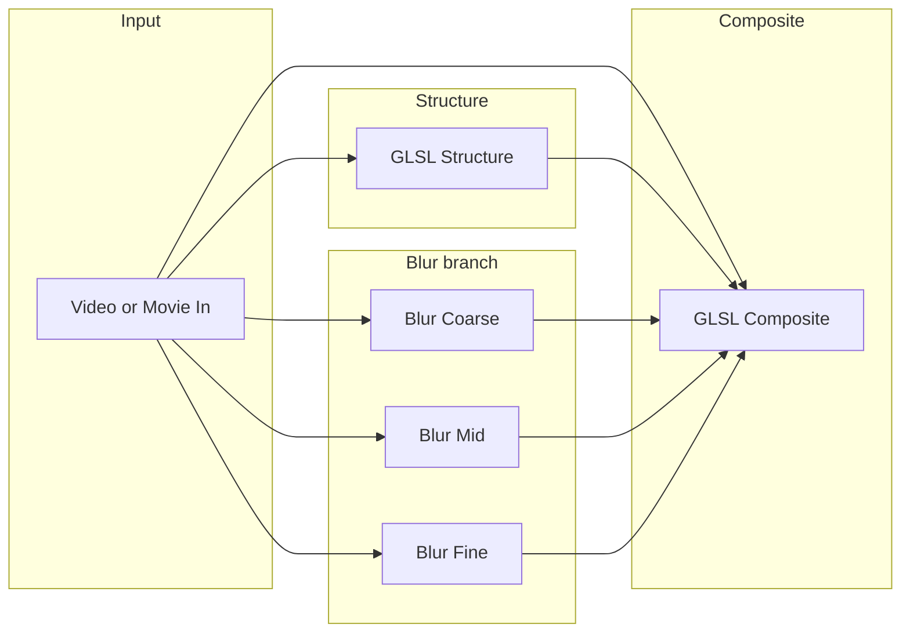

# TouchDesigner realtime painterly look (GLSL)

This folder implements the **visual analog** described in the project plan: multi-scale blurs plus Sobel-derived structure, edge-weighted blending, and optional tangent-direction smear. It is **not** a pixel-exact port of [`painter.py`](../painter.py) `paintify()` (stroke iteration cannot run per frame in a single fragment pass at HD).

## Operator chain (TOP network)

Wire operators in this order:

1. **Input** — `Video Device In TOP` or `Movie File In TOP` (your live or file source).
2. **Optional `Resolution TOP` or `Fit TOP`** — process at 540p–720p for performance, then upscale if needed.
3. **Branch A — blurs** — three `Blur TOP`s driven from the **same** resized source as the structure pass:
   - **Blur Coarse** — largest radius (maps to max `brush_radii`).
   - **Blur Mid** — middle radius.
   - **Blur Fine** — smallest radius.
4. **Branch B — structure** — `GLSL TOP` with pixel code from [`glsl/TD_structure_pixel.glsl`](glsl/TD_structure_pixel.glsl). Input `[0]` = same source as blurs.
5. **Composite** — `GLSL TOP` with pixel code from [`glsl/TD_composite_pixel.glsl`](glsl/TD_composite_pixel.glsl). Inputs:
   - `[0]` original (same as structure input)
   - `[1]` structure GLSL TOP output
   - `[2]` Blur Coarse
   - `[3]` Blur Mid
   - `[4]` Blur Fine
6. **Output** — `Null TOP` / `Composite TOP` / recording or projector as needed.

### Blur radius vs Python `brush_radii`

In Python, `_gaussian_blur_for_radius` uses `sigma ≈ 0.5 * radius` (with kernel clamp). In TouchDesigner, set each **Blur TOP** filter size (pixels) roughly proportional to your radii tuple, e.g. for `(8, 4, 2)`:

| Layer  | Python `r` | Blur TOP size (starting point) |
|--------|------------|--------------------------------|
| Coarse | 8          | ~8–16 px (or Gaussian sigma ~4) |
| Mid    | 4          | ~4–8 px                         |
| Fine   | 2          | ~2–4 px                         |

Tune by eye; resolution changes require retuning.

### Pixel format

- Set the **structure** GLSL TOP output to **16-bit float (RGBA)** if available, so stored gradient magnitude in the **Z** channel is not crushed by 8-bit quantization. If you must use 8-bit, lower `uThreshold` and adjust `uMagNormalize`.

### Performance

- Prefer **Blur TOP** (GPU) over huge loops in one GLSL TOP for large kernels.
- Separable blur is handled internally by the Blur TOP; keep composite GLSL to sampling and mixing.

---

## Uniform cheat sheet (Python `paintify` → GLSL)

Add these as **custom uniforms** on each GLSL TOP (names must match the shader).

### `TD_structure_pixel.glsl`

| Uniform         | Type  | Suggested default | Role |
|-----------------|-------|-------------------|------|
| `uMagNormalize` | float | `0.06`            | Scales raw Sobel magnitude into compressive store `1 - exp(-mag * uMagNormalize)` for **Z**. Raise if edges look weak; lower if everything saturates. |

**Python mapping:** no direct twin; stabilizes edge strength for `threshold`-like behavior downstream.

### `TD_composite_pixel.glsl`

| Uniform           | Type  | Suggested default | Python concept / note |
|-------------------|-------|-------------------|-------------------------|
| `uThreshold`      | float | `0.35`            | **`threshold`**: center edge strength where mid/fine scales kick in (on **compressed** mag in Z, not LAB error). |
| `uThresholdSoft`  | float | `0.12`            | **`grid_factor` / stroke density (loose)**: wider soft region ⇒ gentler transitions between coarse/mid/fine (like fewer, broader placement decisions). |
| `uCurvature`      | float | `0.45`            | **`curvature`**: `0` = no tangent smear; `1` = full smear along tangent. |
| `uOpacity`        | float | `0.92`            | **`opacity`**: `mix(original, painted, uOpacity)`. |
| `uAnisoLength`    | float | `8.0`             | **`max_stroke_length` / radius (loose)**: half-width of tangent samples in **pixels** (shader uses 13 taps, σ≈2). |
| `uEdgeFineMix`    | float | `0.25`            | Pull **`orig`** on strong edges after fine blur (keeps eyes/rim detail). |
| `uUnderpaintMid`  | float | `0.15`            | **`underpaint`**: extra **mid** blur in flat regions for filled-in base look. |

**Not modeled in GLSL:** `min_stroke_length`, `max_strokes_per_layer`, `time_budget_s`, brush PNG texture, LAB error grid, random shuffle. Use the Python app for offline fidelity.

---

## Installing the shaders in TouchDesigner

1. Create a **GLSL TOP**.
2. Set **Vertex Shader** to default (or TouchDesigner template).
3. Paste **Pixel/Fragment** code from `TD_structure_pixel.glsl` or `TD_composite_pixel.glsl`.
4. On the GLSL TOP, add **Uniform** entries for each `uniform` listed above (Vector page / GLSL Uniforms depending on build).
5. For the composite TOP, set **# of Inputs** to **5** and wire textures as listed.

If your build uses different input names, replace `sTD2DInputs[n]` per [Derivative GLSL TOP](https://docs.derivative.ca/GLSL_TOP) documentation.

---

## Gooey halftone (dot clumping) shader

If you want a more “paint dots / clumps” look (dark regions = bigger / denser dots) using the **neighboring cell sampling** + **broken cell wall** + **gooey** approach (inspired by Maxime Heckel’s shader breakdown), use:

- [`glsl/TD_gooey_halftone_pixel.glsl`](glsl/TD_gooey_halftone_pixel.glsl)
- Reference: [“Shades of Halftone”](https://blog.maximeheckel.com/posts/shades-of-halftone/)

### TD operator wiring (single-pass)

1. `Video Device In TOP` (or `Movie File In TOP`)
2. (Optional) `Resolution TOP` to downscale for performance
3. `GLSL TOP` (Pixel Shader = `TD_gooey_halftone_pixel.glsl`)
4. `Null TOP` output

Shader inputs:

- Input `[0]`: the source video/image

### Uniforms (recommended defaults)

Add the following uniforms to the GLSL TOP (names must match):

| Uniform | Type | Suggested start | What it does |
|---|---:|---:|---|
| `uCellSizePx` | vec2 | `(18, 18)` | Grid cell size. Smaller = more dots (denser). |
| `uSearchRadius` | int | `1` | Neighbor radius. `1` = 3×3 (fast). `2` = 5×5 (heavier, gooier). |
| `uBaseRadius` | float | `2.0` | Base dot radius in pixels. |
| `uRadiusByDark` | float | `8.0` | Extra radius added for dark areas. Bigger = darker regions “clump” more. |
| `uGamma` | float | `1.6` | Shapes dark response: higher emphasizes the darkest areas. |
| `uEdgeSoftness` | float | `1.2` | Anti-alias / softness at dot edges (pixels). |
| `uGooeyness` | float | `0.65` | 0 = crisp winner dot; 1 = merged/accumulated dots (gooey). |
| `uBgColor` | vec3 | `(1, 1, 1)` | Background behind dots (paper). |
| `uInkStrength` | float | `1.0` | Overall dot strength. Lower to “wash out” toward background. |

### How it matches your goal

- **Darker parts clump more**: each cell’s dot radius is \(r = uBaseRadius + uRadiusByDark \cdot (1 - \\text{luma})^{uGamma}\). Bigger dots overlap more, and overlap is what produces the “clumping.”  
- **Breaking the cell wall**: each pixel considers dots from neighboring cells (`uSearchRadius`), so large dots can spill past their original cell boundary instead of clipping.
- **Color from the camera**: dot color is sampled from the source at the **cell center**, so dots inherit the video color in that region.

### Tuning workflow (fast)

1. **Set dot density** with `uCellSizePx` (start around 14–24 px at 720p).
2. **Set dot growth** with `uRadiusByDark` (increase until dark zones start merging).
3. **Control clumpiness** with `uGooeyness` (0.4–0.9 range).
4. If dots look too “binary,” increase `uEdgeSoftness` slightly (0.8–2.0).
5. If everything becomes one blob in shadows, either:
   - reduce `uRadiusByDark`, or
   - increase `uCellSizePx`, or
   - lower `uGooeyness`, or
   - reduce `uSearchRadius` back to `1`.

---

## Optional milestone: stroke-like feedback (outline only)

For a **dabbed** look closer to iterative strokes (still not `paintify()`):

1. Add a **Feedback TOP**; prepend a **Null** or **Reorder** so the feedback loop is legal in your TD version.
2. **Previous frame canvas** → blend with **new** composite output:  
   `canvas = mix(newPainted, prevCanvas, persistence)` with `persistence` in `0.85–0.98` for trails, or invert for faster tracking.
3. Optionally **decay toward blurred input** each frame:  
   `canvas = mix(blurredInput, canvas, trackMotion)` so live video does not smear infinitely.
4. **High-error emphasis:** subtract or distance between `blurredInput` and `canvas` in a small GLSL pass; use as mask to **reduce persistence** where error is high (new “strokes” allowed), and **increase persistence** where error is low.

This remains a **heuristic**; expect tuning per shot. Combine with the main two-pass GLSL chain rather than replacing it.

---

## Files

| File | Purpose |
|------|---------|
| [`glsl/TD_structure_pixel.glsl`](glsl/TD_structure_pixel.glsl) | Sobel on luminance; output tangent + magnitude. |
| [`glsl/TD_composite_pixel.glsl`](glsl/TD_composite_pixel.glsl) | Multi-blur blend, edge weights, tangent smear, opacity. |
| [`glsl/TD_gooey_halftone_pixel.glsl`](glsl/TD_gooey_halftone_pixel.glsl) | Single-pass gooey halftone dots (neighbor sampling + dark→bigger dots). |
